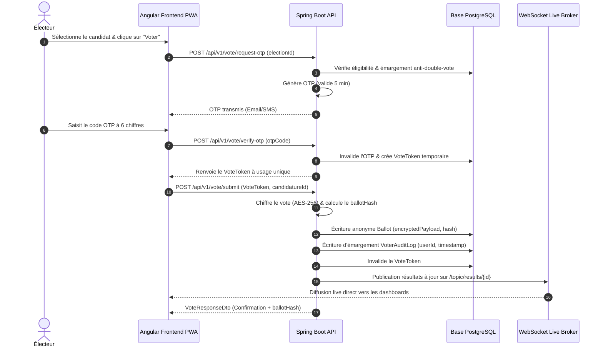

# Documentation Technique & Diagrammes UML – VoteUASZ

Ce document contient la spécification graphique et textuelle de l'architecture UML du système **VoteUASZ**.

---

## 1. Diagramme de Cas d'Utilisation (Use Case Diagram)

```mermaid
usecaseDiagram
    actor SuperAdmin as "Super-Admin Électoral"
    actor Commission as "Commission Électorale"
    actor Candidat as "Candidat"
    actor Electeur as "Électeur"

    SuperAdmin --> (Import CSV des Électeurs)
    SuperAdmin --> (Configuration des Élections)
    SuperAdmin --> (Changement d'État du Scrutin)
    SuperAdmin --> (Consultation de l'Audit Cryptographique)

    Commission --> (Validation/Rejet des Candidatures)
    Commission --> (Traitement des Réclamations)
    Commission --> (Supervision du Dépouillement)

    Candidat --> (Dépôt du Dossier de Candidature)
    Candidat --> (Publication de Campagne - Texte, Affiche, Vidéo)

    Electeur --> (Demande OTP de Vote - 5 min)
    Electeur --> (Soumission du Bulletin Chiffré)
    Electeur --> (Consultation des Résultats Live)
    Electeur --> (Dépôt de Réclamation)
```

---

## 2. Diagramme de Séquence du Vote Sécurisé & OTP


