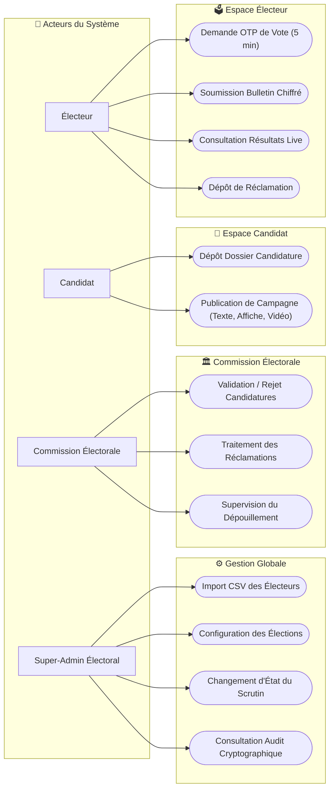
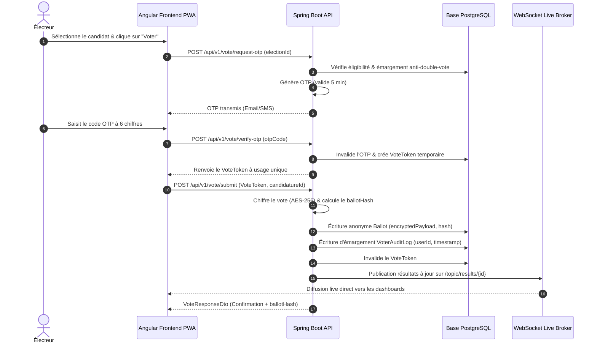

# Documentation Technique & Diagrammes UML – VoteUASZ

Ce document contient la spécification graphique et textuelle de l'architecture UML du système **VoteUASZ**.

---

## 1. Diagramme de Cas d'Utilisation (Use Case Diagram)

---

## 2. Diagramme de Séquence du Vote Sécurisé & OTP

