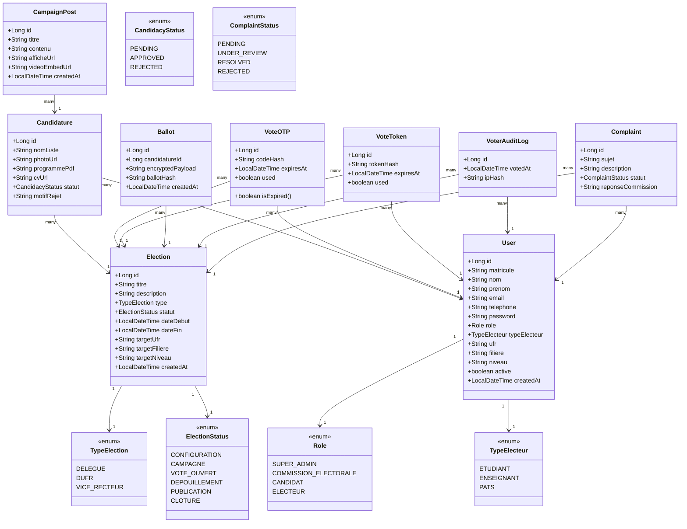

# Diagramme de Classes — VoteUASZ

```mermaid
classDiagram
    class User {
        +Long id
        +String matricule
        +String nom
        +String prenom
        +String email
        +String telephone
        +String password
        +Role role
        +TypeElecteur typeElecteur
        +String ufr
        +String filiere
        +String niveau
        +boolean active
        +LocalDateTime createdAt
    }

    class Election {
        +Long id
        +String titre
        +String description
        +TypeElection type
        +ElectionStatus statut
        +LocalDateTime dateDebut
        +LocalDateTime dateFin
        +String targetUfr
        +String targetFiliere
        +String targetNiveau
        +LocalDateTime createdAt
    }

    class Candidature {
        +Long id
        +String nomListe
        +String photoUrl
        +String programmePdf
        +String cvUrl
        +CandidacyStatus statut
        +String motifRejet
    }

    class CampaignPost {
        +Long id
        +String titre
        +String contenu
        +String afficheUrl
        +String videoEmbedUrl
        +LocalDateTime createdAt
    }

    class VoteOTP {
        +Long id
        +String codeHash
        +LocalDateTime expiresAt
        +boolean used
        +boolean isExpired()
    }

    class VoteToken {
        +Long id
        +String tokenHash
        +LocalDateTime expiresAt
        +boolean used
    }

    class Ballot {
        +Long id
        +Long candidatureId
        +String encryptedPayload
        +String ballotHash
        +LocalDateTime createdAt
    }

    class VoterAuditLog {
        +Long id
        +LocalDateTime votedAt
        +String ipHash
    }

    class Complaint {
        +Long id
        +String sujet
        +String description
        +ComplaintStatus statut
        +String reponseCommission
    }

    class Role {
        <<enum>>
        SUPER_ADMIN
        COMMISSION_ELECTORALE
        CANDIDAT
        ELECTEUR
    }

    class TypeElecteur {
        <<enum>>
        ETUDIANT
        ENSEIGNANT
        PATS
    }

    class TypeElection {
        <<enum>>
        DELEGUE
        DUFR
        VICE_RECTEUR
    }

    class ElectionStatus {
        <<enum>>
        CONFIGURATION
        CAMPAGNE
        VOTE_OUVERT
        DEPOUILLEMENT
        PUBLICATION
        CLOTURE
    }

    class CandidacyStatus {
        <<enum>>
        PENDING
        APPROVED
        REJECTED
    }

    class ComplaintStatus {
        <<enum>>
        PENDING
        UNDER_REVIEW
        RESOLVED
        REJECTED
    }

    User "1" --> "1" Role
    User "1" --> "1" TypeElecteur
    Election "1" --> "1" TypeElection
    Election "1" --> "1" ElectionStatus

    Candidature "many" --> "1" Election
    Candidature "many" --> "1" User

    CampaignPost "many" --> "1" Candidature

    VoteOTP "many" --> "1" User
    VoteOTP "many" --> "1" Election

    VoteToken "many" --> "1" User
    VoteToken "many" --> "1" Election

    Ballot "many" --> "1" Election

    VoterAuditLog "many" --> "1" User
    VoterAuditLog "many" --> "1" Election

    Complaint "many" --> "1" Election
    Complaint "many" --> "1" User
```
