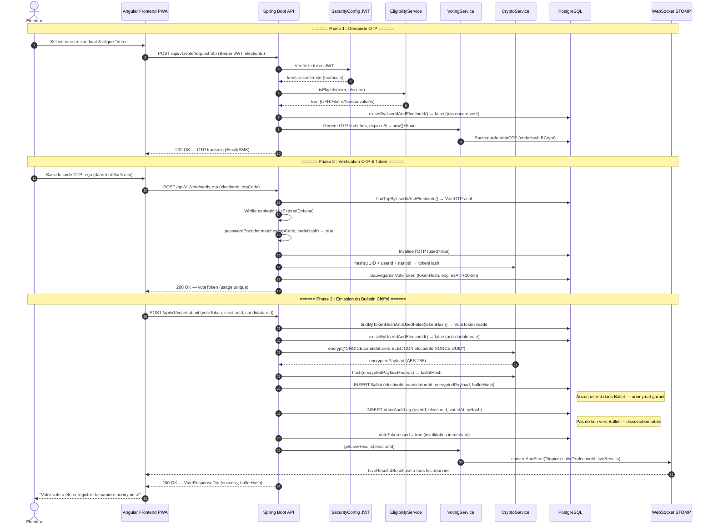

# Diagramme de Séquence — Vote Sécurisé OTP VoteUASZ

```mermaid
sequenceDiagram
    autonumber
    actor E as Électeur
    participant FE as Angular Frontend PWA
    participant API as Spring Boot API
    participant SEC as SecurityConfig JWT
    participant ELG as EligibilityService
    participant VOT as VotingService
    participant CRYPT as CryptoService
    participant DB as PostgreSQL
    participant WS as WebSocket STOMP

    Note over E,WS: ====== Phase 1 : Demande OTP ======

    E->>FE: Sélectionne un candidat & clique "Voter"
    FE->>API: POST /api/v1/vote/request-otp (Bearer JWT, electionId)
    API->>SEC: Vérifie le token JWT
    SEC-->>API: Identité confirmée (matricule)
    API->>ELG: isEligible(user, election)
    ELG-->>API: true (UFR/Filière/Niveau validés)
    API->>DB: existsByUserIdAndElectionId() → false (pas encore voté)
    API->>VOT: Génère OTP 6 chiffres, expiresAt = now()+5min
    VOT->>DB: Sauvegarde VoteOTP (codeHash BCrypt)
    API-->>FE: 200 OK — OTP transmis (Email/SMS)

    Note over E,WS: ====== Phase 2 : Vérification OTP & Token ======

    E->>FE: Saisit le code OTP reçu (dans le délai 5 min)
    FE->>API: POST /api/v1/vote/verify-otp (electionId, otpCode)
    API->>DB: findTopByUserIdAndElectionId() → VoteOTP actif
    API->>API: Vérifie expiration (isExpired()=false)
    API->>API: passwordEncoder.matches(otpCode, codeHash) → true
    API->>DB: Invalide l'OTP (used=true)
    API->>CRYPT: hash(UUID + userId + nanos) → tokenHash
    API->>DB: Sauvegarde VoteToken (tokenHash, expiresAt=+10min)
    API-->>FE: 200 OK — voteToken (usage unique)

    Note over E,WS: ====== Phase 3 : Émission du Bulletin Chiffré ======

    FE->>API: POST /api/v1/vote/submit (voteToken, electionId, candidatureId)
    API->>DB: findByTokenHashAndUsedFalse(tokenHash) → VoteToken valide
    API->>DB: existsByUserIdAndElectionId() → false (anti-double-vote)
    API->>CRYPT: encrypt("CHOICE:candidatureId:ELECTION:electionId:NONCE:UUID")
    CRYPT-->>API: encryptedPayload (AES-256)
    API->>CRYPT: hash(encryptedPayload+nanos) → ballotHash
    API->>DB: INSERT Ballot (electionId, candidatureId, encryptedPayload, ballotHash)
    Note right of DB: Aucun userId dans Ballot — anonymat garanti
    API->>DB: INSERT VoterAuditLog (userId, electionId, votedAt, ipHash)
    Note right of DB: Pas de lien vers Ballot — dissociation totale
    API->>DB: VoteToken.used = true (invalidation immédiate)
    API->>VOT: getLiveResults(electionId)
    VOT->>WS: convertAndSend("/topic/results/"+electionId, liveResults)
    WS-->>FE: LiveResultsDto diffusé à tous les abonnés
    API-->>FE: 200 OK — VoteResponseDto (success, ballotHash)
    FE-->>E: "Votre vote a été enregistré de manière anonyme ✅"
```
