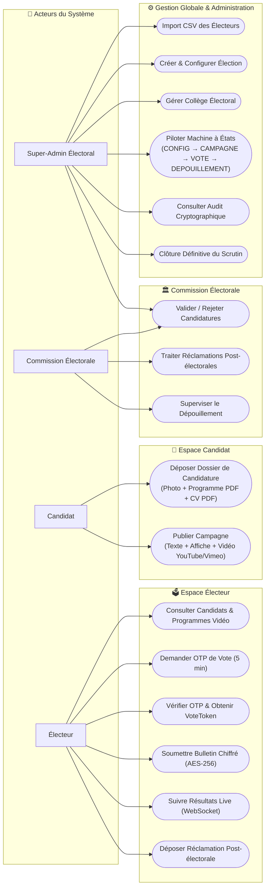

# Diagramme de Cas d'Utilisation — VoteUASZ

```mermaid
flowchart LR
    subgraph Acteurs ["👤 Acteurs du Système"]
        SuperAdmin["Super-Admin Électoral"]
        Commission["Commission Électorale"]
        Candidat["Candidat"]
        Electeur["Électeur"]
    end

    subgraph Admin_Space ["⚙️ Gestion Globale & Administration"]
        UC1(["Import CSV des Électeurs"])
        UC2(["Créer & Configurer Élection"])
        UC3(["Gérer Collège Électoral"])
        UC4(["Piloter Machine à États<br/>(CONFIG → CAMPAGNE → VOTE → DEPOUILLEMENT)"])
        UC5(["Consulter Audit Cryptographique"])
        UC6(["Clôture Définitive du Scrutin"])
    end

    subgraph Commission_Space ["🏛️ Commission Électorale"]
        UC7(["Valider / Rejeter Candidatures"])
        UC8(["Traiter Réclamations Post-électorales"])
        UC9(["Superviser le Dépouillement"])
    end

    subgraph Candidat_Space ["📢 Espace Candidat"]
        UC10(["Déposer Dossier de Candidature<br/>(Photo + Programme PDF + CV PDF)"])
        UC11(["Publier Campagne<br/>(Texte + Affiche + Vidéo YouTube/Vimeo)"])
    end

    subgraph Electeur_Space ["🗳️ Espace Électeur"]
        UC12(["Consulter Candidats & Programmes Vidéo"])
        UC13(["Demander OTP de Vote (5 min)"])
        UC14(["Vérifier OTP & Obtenir VoteToken"])
        UC15(["Soumettre Bulletin Chiffré (AES-256)"])
        UC16(["Suivre Résultats Live (WebSocket)"])
        UC17(["Déposer Réclamation Post-électorale"])
    end

    SuperAdmin --> UC1
    SuperAdmin --> UC2
    SuperAdmin --> UC3
    SuperAdmin --> UC4
    SuperAdmin --> UC5
    SuperAdmin --> UC6
    SuperAdmin --> UC7

    Commission --> UC7
    Commission --> UC8
    Commission --> UC9

    Candidat --> UC10
    Candidat --> UC11

    Electeur --> UC12
    Electeur --> UC13
    Electeur --> UC14
    Electeur --> UC15
    Electeur --> UC16
    Electeur --> UC17
```
